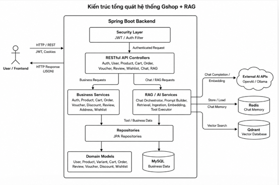
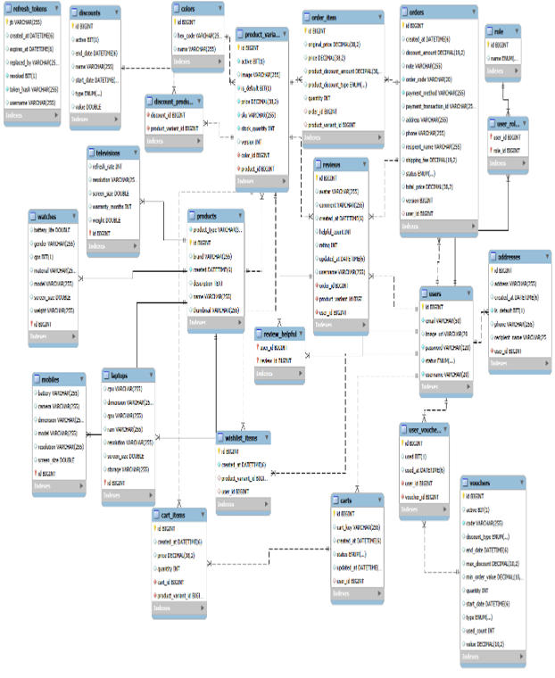
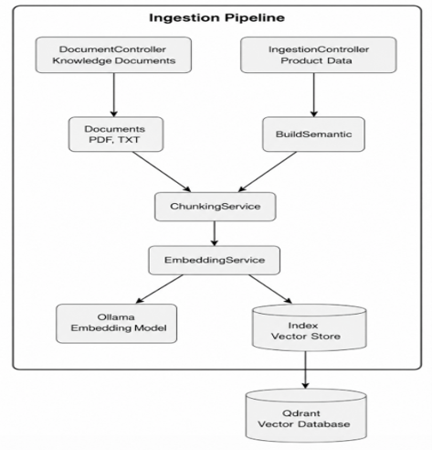
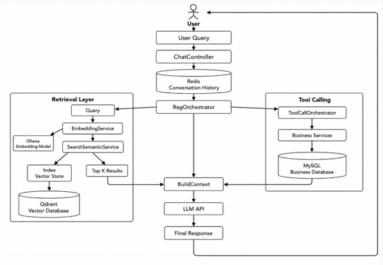

# G-Shop - Website thương mại điện tử tích hợp Chatbot RAG

README này tóm tắt nội dung dự án từ `DATN_NguyenVanHauGiang_2022604193.docx` và sử dụng các sơ đồ trong thư mục `images`.

## Tổng quan

G-Shop là website thương mại điện tử dành cho sản phẩm công nghệ. Hệ thống tích hợp chatbot AI dựa trên kiến trúc RAG (Retrieval-Augmented Generation) để hỗ trợ người dùng tìm kiếm sản phẩm, xem thông tin chi tiết, quản lý giỏ hàng, đặt hàng, áp dụng voucher, theo dõi lịch sử đơn hàng và hỏi đáp về sản phẩm.

Chatbot RAG truy xuất dữ liệu sản phẩm, tài liệu tri thức và dữ liệu nghiệp vụ động trước khi sinh câu trả lời. Cách tiếp cận này giúp giảm câu trả lời sai, cải thiện khả năng cập nhật thông tin và bảo đảm phản hồi bám sát dữ liệu thực tế của hệ thống.

## Mục tiêu

- Nghiên cứu và ứng dụng kiến trúc RAG cho chatbot AI trong website thương mại điện tử.
- Xây dựng chatbot hỗ trợ tư vấn sản phẩm, trả lời câu hỏi thường gặp, cung cấp thông tin giá bán, cấu hình, chính sách bảo hành và trạng thái đơn hàng.
- Tích hợp truy xuất ngữ nghĩa bằng vector database.
- Đánh giá hệ thống theo độ chính xác câu trả lời, thời gian phản hồi, khả năng giữ ngữ cảnh và trải nghiệm người dùng.

## Chức năng chính

### Khách hàng

- Đăng ký, đăng nhập và xác thực tài khoản.
- Xem danh sách sản phẩm, chi tiết sản phẩm, biến thể, giá bán và đánh giá.
- Tìm kiếm sản phẩm bằng từ khóa hoặc thông qua chatbot RAG.
- Thêm sản phẩm vào danh sách yêu thích.
- Thêm, cập nhật và xóa sản phẩm trong giỏ hàng.
- Đặt hàng, thanh toán đơn hàng và áp dụng voucher hoặc mã giảm giá.
- Quản lý địa chỉ giao hàng.
- Theo dõi trạng thái đơn hàng và xem lịch sử mua hàng.
- Chat với chatbot AI để được tư vấn, so sánh sản phẩm và hỏi các thông tin liên quan.

### Quản trị viên

- Xem dashboard thống kê doanh thu, đơn hàng và sản phẩm bán chạy.
- Quản lý người dùng, sản phẩm, biến thể sản phẩm, danh mục và tồn kho.
- Quản lý đơn hàng, voucher, mã giảm giá và đánh giá.
- Quản lý dữ liệu phục vụ chatbot RAG, gồm upload tài liệu, nạp dữ liệu, kiểm thử truy xuất và kiểm tra phản hồi AI.

## Kiến trúc hệ thống



Hệ thống được tổ chức theo nhiều lớp:

- Frontend xử lý giao diện website thương mại điện tử và giao diện chatbot.
- Backend Spring Boot cung cấp RESTful API, xử lý nghiệp vụ và điều phối chatbot.
- Security layer xác thực request bằng JWT/Auth Filter trước khi chuyển vào controller.
- Business services xử lý nghiệp vụ Auth, Product, Cart, Order, Voucher, Discount, Review, Address và Wishlist.
- JPA repositories lưu trữ và truy xuất dữ liệu nghiệp vụ trong MySQL.
- RAG/AI services xử lý truy vấn chatbot, nạp dữ liệu, truy xuất, bộ nhớ hội thoại và tool calling.
- Redis lưu bộ nhớ hội thoại để duy trì ngữ cảnh chat.
- Qdrant lưu vector embedding và hỗ trợ tìm kiếm ngữ nghĩa.
- Ollama hoặc OpenAI được dùng cho embedding hoặc sinh phản hồi tùy theo cấu hình.



## Luồng RAG

### Nạp dữ liệu



1. Dữ liệu sản phẩm hoặc tài liệu tri thức được chuẩn hóa thành văn bản.
2. Nội dung được chia thành các chunk nhỏ.
3. Hệ thống tạo embedding cho từng chunk.
4. Vector embedding và metadata được lưu vào Qdrant.

### Kiến trúc chatbot



1. Người dùng gửi câu hỏi qua chatbot.
2. Backend lưu lịch sử hội thoại trong Redis.
3. `RagOrchestrator` điều phối phân tích truy vấn, truy xuất dữ liệu và xây dựng prompt.
4. Hệ thống tạo embedding cho câu hỏi và tìm kiếm ngữ nghĩa trong Qdrant.
5. Hybrid reranking chọn ngữ cảnh phù hợp nhất.
6. Prompt kết hợp câu hỏi, lịch sử hội thoại, ngữ cảnh truy xuất và dữ liệu tool calling khi cần.
7. LLM sinh câu trả lời cuối cùng cho người dùng.

## Công nghệ sử dụng

- Backend: Java 21, Spring Boot, Spring Data JPA, RESTful API.
- Frontend: Next.js, React, Node.js, npm.
- Cơ sở dữ liệu nghiệp vụ: MySQL.
- Vector database: Qdrant.
- Bộ nhớ hội thoại: Redis.
- AI/Embedding: Ollama hoặc OpenAI API tùy cấu hình.
- Dịch vụ phụ trợ: Docker.
- Bảo mật: JWT, refresh token, phân quyền theo vai trò.

## Yêu cầu môi trường

- JDK 21.
- Node.js và npm.
- MySQL.
- Redis.
- Qdrant.
- Ollama chạy tại `http://localhost:11434` nếu sử dụng Ollama.
- Docker nếu chạy Redis hoặc Qdrant bằng container.

Kiểm tra Java:

```bash
java -version
```

Kiểm tra Node.js và npm:

```bash
node -v
npm -v
```

## Cấu hình

Cấu hình các biến môi trường cần thiết trước khi chạy hệ thống:

```env
DB_URL=
DB_USERNAME=
DB_PASSWORD=
JWT_SECRET=
API_KEY=
```

Tùy mã nguồn thực tế, có thể cần thêm cấu hình cho Redis, Qdrant, Ollama/OpenAI và các thiết lập bảo mật khác.

## Chạy hệ thống

### Backend

1. Cài đặt và khởi động MySQL, Redis, Qdrant và Ollama.
2. Tải model embedding cho Ollama nếu hệ thống dùng Ollama.
3. Mở project bằng IntelliJ IDEA.
4. Chọn `Build Project` hoặc `Run` để khởi động backend.

Backend mặc định chạy tại:

```text
http://localhost:8080
```

Theo báo cáo dự án, hệ thống có thể tích hợp frontend trong backend. Vì vậy khi build hoặc chạy backend, frontend có thể được khởi động hoặc phục vụ kèm theo tùy cấu hình dự án.

### Frontend

Nếu chạy frontend riêng:

```bash
npm install
npm run dev
```

Frontend mặc định chạy tại:

```text
http://localhost:3000
```

## Kiểm thử và đánh giá

Kiểm thử tập trung vào các luồng chính: mua hàng, chatbot RAG và chức năng quản trị.

Kết quả trong báo cáo:

- Chatbot RAG đạt tỷ lệ trả lời đúng trung bình 86,2% trên 65 câu hỏi thử nghiệm.
- Thời gian phản hồi trung bình khoảng 2,6 giây trong môi trường kiểm thử cục bộ.
- Nhóm câu hỏi ngoài phạm vi và truy vấn cần dữ liệu động có độ chính xác thấp hơn vì phụ thuộc vào dữ liệu đã nạp vào Qdrant, nhận diện intent và độ ổn định của tool calling.

## Kết quả đạt được

- Hoàn thiện các chức năng thương mại điện tử cốt lõi: đăng ký, đăng nhập, xem sản phẩm, giỏ hàng, đặt hàng, voucher, địa chỉ và lịch sử đơn hàng.
- Tích hợp chatbot RAG vào giao diện người dùng.
- Chatbot có thể tư vấn, so sánh sản phẩm và trả lời dựa trên dữ liệu sản phẩm, tài liệu tri thức và ngữ cảnh hội thoại.
- Xây dựng module quản trị cho dashboard, quản lý người dùng, quản lý đơn hàng, quản lý sản phẩm và quản lý dữ liệu RAG.
- Thiết kế kiến trúc tách biệt giữa nghiệp vụ bán hàng, lưu trữ dữ liệu, truy xuất ngữ nghĩa và sinh phản hồi AI.

## Hạn chế

- Kiểm thử chủ yếu tập trung ở môi trường cục bộ, chưa đánh giá sâu khả năng chịu tải khi nhiều người dùng truy cập đồng thời.
- Chất lượng phản hồi chatbot phụ thuộc vào dữ liệu nạp vào Qdrant, chất lượng embedding và khả năng cập nhật dữ liệu sản phẩm theo thời gian thực.
- Một số luồng nghiệp vụ như vận chuyển, thông báo đơn hàng và đánh giá RAG tự động vẫn cần hoàn thiện thêm trước khi triển khai thực tế.

## Hướng phát triển

- Bổ sung kiểm thử hiệu năng, kiểm thử bảo mật và bộ đánh giá tự động cho chatbot RAG.
- Tích hợp API vận chuyển, thông báo email/SMS và đồng bộ trạng thái đơn hàng.
- Phát triển phiên bản mobile hoặc PWA.
- Mở rộng module quản trị dữ liệu RAG để theo dõi lịch sử nạp dữ liệu, lỗi ingestion và chất lượng truy xuất.

## Tác giả

- Sinh viên: Nguyễn Văn Hậu Giang.
- Đề tài: Ứng dụng kiến trúc RAG trong phát triển chatbot cho website thương mại điện tử.
- Trường: Đại học Công nghiệp Hà Nội.
- Năm: 2026.
